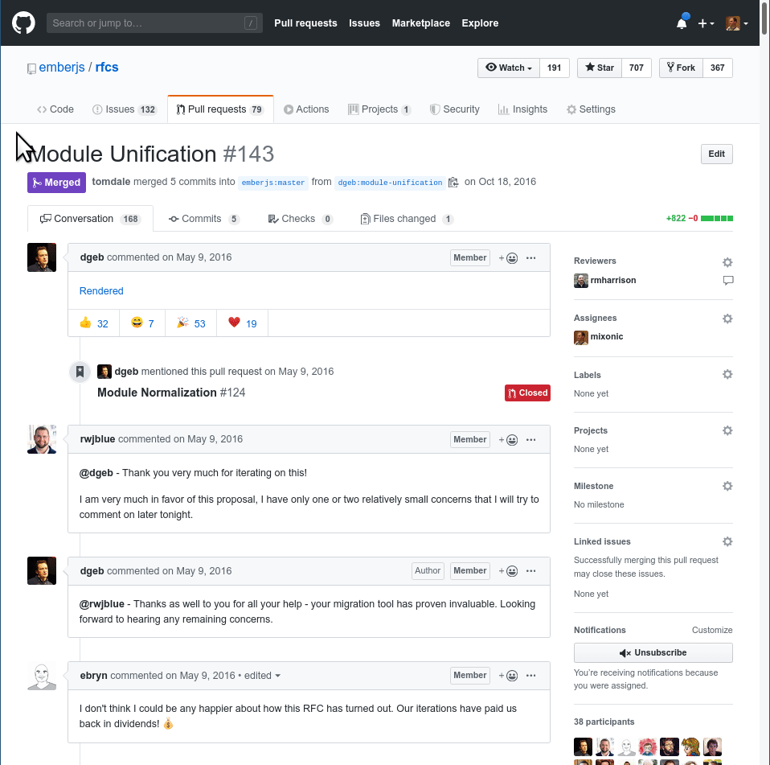
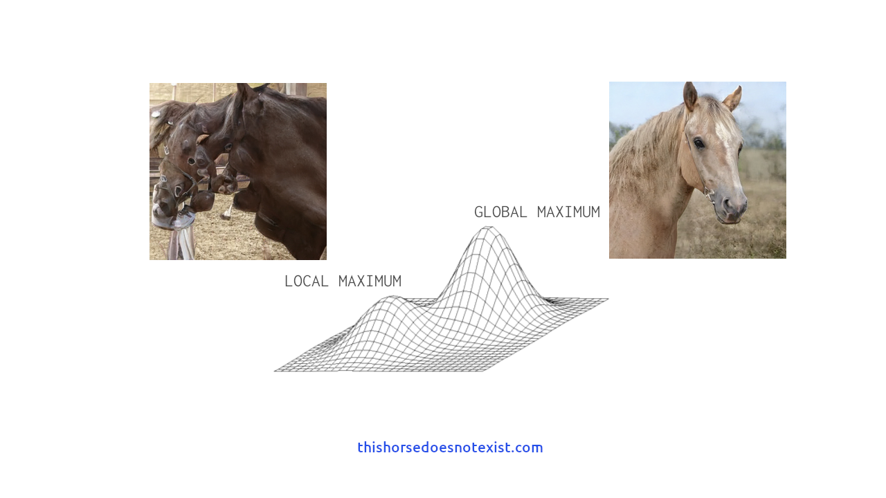
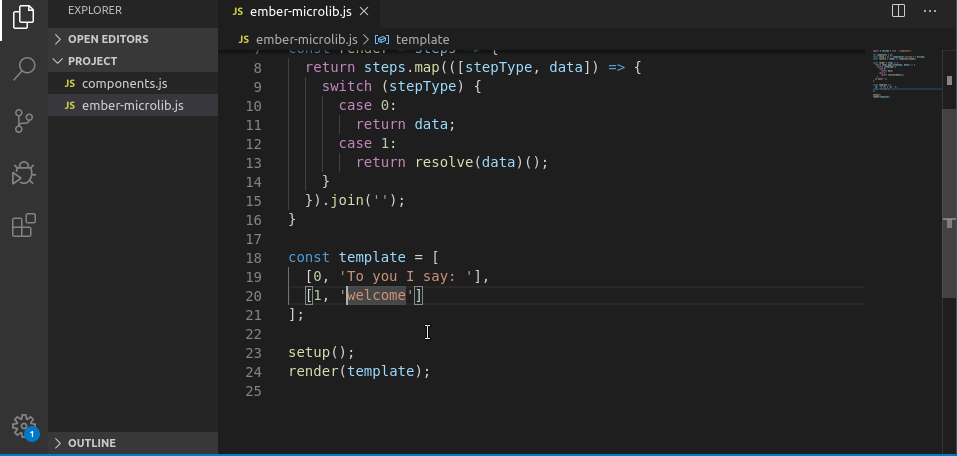
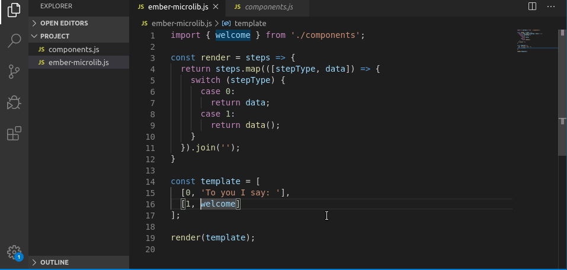

<!-- _class: title -->
<!-- _footer: "" -->
<!-- _paginate: false -->

<style scoped>
p {
 font-size: 0.9em;
}
</style>

# Why JavaScript is Coming to Ember Templates

###### Slides at [bit.ly/js-in-templates-2020](http://bit.ly/js-in-templates-2020)

###### Matthew Beale<br>Ember Framework & Steering<br>Engineering @ [Addepar](https://addepar.com/).

###### _We're hiring! Come work with me in NYC._


<!--

Good afternoon! I'm Matthew Beale and I'm excited to speaking with you again
here at EmberConf. 

I've been increadibly inspired by the work Tilde, the
conference organizers, my fellow speakers, and many others have done to make
this conference a success despite overwhelming circumstances. My heart and
thanks go out to each of you for making this feel like a real community moment.

Last year I started a new role in engineering at Addepar. We work on one
of the longest-maintained Ember codebases, and additionally on a couple new
app using Ember Octane. In a big project like ours, you quickly learn to
prioritize writing code that is easy to read, and thats one of the reasons
this topic today it important to me.

Ok, so, there is a joke on the core teams, it goes...

-->

---

<!-- _class: secondary -->

## "No more unification RFCs"


<!--

Maybe some of you have an idea why.

-->

---




<!--

Just before EmberConf last year we decided to withdraw this RFC, the Module
Unification RFC, from consideration. It might seem late to be talking about
this topic and I won't be talking about Module Unification in detail.

What you should understand, if you don't already, is that Module Unification
was a last attempt at cleaning up some loose ends in how we organize and
reference files in Ember.

-->

---

```hbs
To you I say: <Welcome />
```

<!--

Lets say we're reading this template: Most Ember developers would intuit
that they could look for the definition of `Welcome`'s template here:

-->

- `app/templates/components/welcome.hbs`

<!--

and that is often correct.

But if you want to build an implementation of jump to definition..

-->

---

```hbs
To you I say: <Welcome />
```

- `app/templates/components/welcome.hbs`
- `app/templates/components/welcome/template.hbs`
- `node_modules/an-addon/app/templates/components/welcome.hbs`
- `node_modules/an-addon/app/templates/components/welcome/template.hbs`
- `node_modules/a-different-addon/app/templates/components/welcome.hbs`
- Actually, it could literally be anywhere since resolvers are a runtime concern :grimacing:

<!--

...or get
TypeScript to understand where the component's template might be, you need
to consider a number of other valid locations.

Ember's resovler permits component templates to be defined in a number of different
locations in your app and addons, and the logic for deciding which to use is implemented as part of
the application's runtime logic.

That makes
it challenging to support common static tooling like IDEs, type systems,
and bundlers common across other parts of the JavaScript community.

-->

---
<style scoped>
  section {
    background-color: white;
  }
</style>


<!--

Maybe you're already familiar with the concept of a local maximum? When you're looking
for a solution to a problem there are probably may possible solutions. And
the path to get from solution to solution may not be linear, making it easy
to over focus on what you already think is best.

You'll often read about this idea if you dig into neural network systems.

-->

---
<style scoped>
  section {
    background-color: white;
  }
</style>



<!--

For example the nn on this horse-generating AI website managed to generate a
realistic image of a horse on the right as a global maxima, but in other cases
it was equally confident but missed the mark.

Module Unification was a local maxima. We had identified where Ember's
resolution system wasn't always clear about which file should be resolved,
and Module Unification introduced more formal rules and requirements to
"unify" the system.

In hindsight it was a local maximum, and the rest of the JavaScript community
was climbing the hill to a better solution. This talk is about how we're going
to align Ember with that better solution.

-->

---

<!-- header: "Matt's Resolving Ember Microlib" -->

`components.js`

```js
export function welcome() {
  return '<strong>Welcome!</strong>';
};
```

<!--

To illustrate the problem with Ember's resolver system lets build a little
fork of Ember I'll call Matt's Elegant Ember Microlib. Here is a component
in my framework, you can see it just returns a string.

-->

---

<!-- header: "" -->

```js
import { welcome } from './components';

let components = {};
const setup = () => components['welcome'] = welcome;
const resolve = (name) => components[name];

const render = steps => {
  return steps.map(([stepType, data]) => {
    switch (stepType) {
      case 0:
        return data;
      case 1:
        return resolve(data)();
    }
  }).join('');
}

const template = [
  [0, 'To you I say: '],
  [1, 'welcome']
];

setup();
render(template);
```

<!--

So here is my framework. I import my components, add them to a named list in
setup, and resolve looks them up from that list.

Further down I've got a template inspired by Glimmer's opcode system, and
a render function above that processes that. When the opcode 1 is present,
that component is resolved and called.

The data passed with opcode 1 is the string `welcome`. This is the crux of a
dynamic system: Instead of referencing the component directly, or template is
using a name for the component. That introduces ambiguity about what the
string is used for, ambiguity a lot of tooling can't penetrate.

Let's see how that ambiguity presents itself in two common ways.

-->

---

<!-- header: "Matt's Resolving Ember Microlib" -->

```js
// rollup -i ember-microlib.js | terser --compress --mangle --toplevel --beautify
function e() {
  return "<strong>Welcome!</strong>";
}

let o = {};

o.welcome = e, [ [ 0, "To you I say: " ], [ 1, "welcome" ] ].map(([e, n]) => {
  switch (e) {
    case 0:
      return n;

    case 1:
      return o[n]();
  }
}).join("");
```

<!--

First, I've run the program through some popular build tools: Rollup and terser.

Rollup takes advantage of the fact that ES modules are static. That is,
the imports and exports from a module can be understood without running that
code. Rollup figures out how to take your multiple modules and safely
combine them into a single JavaScript program. You can think of it as a simple
compiler which takes our dependency, the component, and links it to the main
program.

Terser is a minification tool that uses static analysis to make your JavaScript
payload smaller.

For this version of the program, the output looks like what we would expect.
the component is present, and the rendering logic is present.

-->

---

<!-- header: "Matt's Resolving Ember Microlib" -->

```js
const template = [
  [0, 'To you I say: '],
  [1, 'welcome']
];
```

<!--

But lets change the template. Instead of calling opcode 1 to print the
component, lets just render more text with opcode 0.

-->

---

<!-- header: "Matt's Resolving Ember Microlib" -->

```js
const template = [
  [0, 'To you I say: '],
  [0, 'a fond farewell']
];
```

<!--

Ok, lets compile this.

-->

---

<!-- header: "Matt's Resolving Ember Microlib" -->


```js
// rollup -i ember-microlib.js | terser --compress --mangle --toplevel --beautify
function e() {
  return "<strong>Welcome!</strong>";
}

let n = {};

n.welcome = e, [ [ 0, "To you I say: " ], [ 0, "a fond farewell" ] ].map(([e, o]) => {
  switch (e) {
    case 0:
      return o;

    case 1:
      return n[o]();
  }
}).join("");
```

<!--

In this output you wouldn't expect the component logic to be present, since we
stopped referencing it in the templates. But because that relationship was
something resolved at runtime and because rollup and terser don't know what the
program will actually do, they aren't able to strip it out.

Tool like Embroider close this gap by teaching build tools to assume
things about the runtime during build-time analysis, but I can give you another
example of how the resolver's dynamic implementation frustrates analysis.

-->

---

<!-- header: "Matt's Resolving Ember Microlib" -->



<!--

Finding a second example of how the abigutity of our resolver-based library has practical impacts is
as easy as looking at the most popular IDE for Ember users: VSCode. Here
I've opened the micro lib and I've attempted to jump the definition of the
component as it is referenced in the template.

It isn't surprising this doesn't work: The data in the template is only a
string. Again, in order to resolve this ambiguity about the meaning of
the string "welcome" we would need to write a custom language server and
encode certain assumptions about where to look for definitions.

-->

---

<!-- header: "" -->

# Dynamic resolution vs. static linking

```hbs
To you I say: <Welcome />
```

<!--

The first draft of my microlib used dynamic resolution to look up components.
Then the application boots, the available components are put in to a map then
templates reference them by strings. In order for our eyes to know where to
find a definition, or for our tooling to know, we need to teach those systems
what the rules for resolution are.

That's why when I ask *you* where to find the Welcome component, you can give
a reasonable answer. You've internalized the rules.

In contrast a static system, one based on ES modules, will always be explicit
about where to find a definition.

Lets build a second draft of the microlib, this time a static version.

-->

---

<!-- header: "" -->

```js
import { welcome } from './components';

const render = steps => {
  return steps.map(([stepType, data]) => {
    switch (stepType) {
      case 0:
        return data;
      case 1:
        return data();
    }
  }).join('');
}

const template = [
  [0, 'To you I say: '],
  [1, welcome]
];

render(template);
```

<!--

In this version of the template I've referenced
the welome component directly. There is no setup, no list of components,
no resolver.

Further more if you want to see where the welcome component comes from there
is little code to think about, right? You simple look to where the variable was
introduced. Here, as an import.

-->


---

<!-- header: "Matt's Static Ember Microlib" -->



<!--

Now that the template contains a direct reference to the component, we don't
need to teach tooling about any ambiguous cases. That means jump to definition
will just work in a template like it would in most JavaScript code.

-->
---

```js
// rollup -i ember-microlib.js | terser --compress --mangle --toplevel --beautify
[ [ 0, "To you I say: " ], [ 1, function() {
  return "<strong>Welcome!</strong>";
} ] ].map(([n, r]) => {
  switch (n) {
    case 0:
      return r;

    case 1:
      return r();
  }
}).join("");
```

<!--

And when the bundlers process this, the implementation of the component is
actually written directly into the template a compilation time. Cool.

We've made the link between the program and the component static. The tooling
can not only understand where the component is being used, it can also
understand if it isn't used at all.

-->

---

```js
// rollup -i ember-microlib.js | terser --compress --mangle --toplevel --beautify
[ [ 0, "To you I say: " ], [ 0, "a fond farewell" ] ].map(([a, e]) => {
  switch (a) {
    case 0:
      return e;

    case 1:
      return e();
  }
}).join("");
```

<!--

For example if we change the second render step back to "a fond farewell"
instead of a component invocation, the bundler understands that the variable
is not referenced and the entire component implementation can be dropped.

Great. So Ember's templates are more featureful than my microlib. How can we
bring the benefits of a staticly linked system to Ember itself?

-->

---

<!-- header: "" -->

# Handlebars Strict Mode

<!--

So what would a static template in Ember look like?

Well Godfrey Chan has been exploring this in RFC #496. In that RFC he proposes
strict templates in Ember. We call this a "mode" because like strict mode in
JavaScript, it opts the user into a version of the language where messy edge
cases are disabled.

-->

---

### What are the constraints in strict mode? 

* No implicit `this` fallback. `{{foo}}` doesn't imply `{{this.foo}}`.
* No resolution. For example `{{foo-bar}}` is only ever a variable.
* No dynamic resolution. `{{component this.dynamicName}}`.
* No partials. `{{partial 'foo-bar'}}`.

<!--

What makes a strict mode template? Really it is a list of things we remove
from the framework. Lint warnings and deprecations already encourage
developers to follow the first two constraints.

But the second two constraints seem bizarre when you think about them in
isolation.

-->

---

<!-- header: "Handlebars Strict Mode" -->

```hbs
{{#each @greetings as |myGreeting|}}
  To {{this.subjectName}} I say: <q>{{myGreeting}}</q>
{{/each}}
```

<!--

So here is an example of a  handlebars strict mode template.
It shouldn't look very different than an Ember template you might work in
today.

It contains...

-->

* Built-in helpers, arguments, block params, and accessing properties off the
  component state work just like they do in a regular template.
<!--

However so that this template can have a static relationship to any
components it might invoke, it also can't do some regular things..

-->
* There isn't a way to invoke a component from `app/`. For example, `<Quote />`
  would not render a component.
<!--

And this brings us to the crux: We need a static solution for getting
other components into the local scope of a strict mode template. Since
we want to bundle our application as JavaScript, we want to do something that
works with ES modules.

And to work with ES modules, we need to consider what a strict mode template
looks like when it is compiled to JavaScript.

-->

---

<!-- header: "" -->

###### Source template:

```hbs
{{#each @greetings as |myGreeting|}}
  To {{this.subjectName}} I say: <Quote>{{myGreeting}}</Quote>
{{/each}}
```

###### Compiled output:

```js
import { createTemplateFactory } from '@ember/template-factory';
import Quote from './quote';

export default createTemplateFactory({
  "id": "ANJ73B7b",
  "block": "{\"statements\":[\"...\"]}",
  "meta": { "moduleName": "greetings.hbs" },
  "strict": true,
  "scope": () => [Quote]
});
```

<!--

Here a strict mode template is compiled into JavaScript. To bring Quote
into scope, I've imported it from a file in the same directory.

Just like with my static microlib earlier, the definition of the component
is now itself passed to the compiled template. Common build tooling would
work well with this output, and given some work on sourcemaps we can make
jump-to-definition work.

Of course this API, which is as far as the handlebars strict mode RFC goes,
is only a primitive. We don't write compiled templates by
hand. To make this readable and usable we need to find a way to lift the
import statement into the template itself.

Which takes us to template imports.

-->

---

<!-- header: "" -->

# Template Imports

<!--

There are several plausible approaches to getting imports into templates.
To keep our design unsurprising
to both new developers and advanced users, we think two constraints are
important to keep in mind:

-->

* You can import a default or a named export into your template.
* The right side of an import, the path, works just like it does in any
  system using Node.js resolution.

<!--

Given that we accept these constraints, it begs a question: If we're going
to constrain ourselves so closly to re-implementing the way ES modules already
work, why not simply adopt ES syntax into templates? In fact, any design which
isn't simply module syntax seems to bend commmon sense past the breaking point.

So that is what we're going to do. Let's take a look.

-->

---

<!-- header: Template Imports -->

###### A single component import

```hbs
---
import Quote from './quote';
---
{{#each @greetings as |myGreeting|}}
  To {{this.subjectName}} I say: <Quote>{{myGreeting}}</Quote>
{{/each}}
```

<!-- 

A strict mode template doesn't need to have any imports. If it doesn't then
the template can skip any preamble. If it does, we introduce a block for
writing imports above the template itself. 

In this block we're going to permit only import syntax in our first pass.

-->

---

###### Imports from the app, framework, and an addon

```hbs
---
import Quote from './quote';
import { titleize } from '@ember/template-helpers';
import { animatedEach } from 'ember-animated/helpers';
---
{{#animatedEach @greetings as |myGreeting|}}
  To {{titleize this.subjectName}} I say: <Quote>{{myGreeting}}</Quote>
{{/each}}
```

<!--

Imports can come from any path, so here from the local file quote, or from the
framework itself with titlize, or from an addon as with animatedEach.

This opens up new organization options for your app. If you have a naturally
grouped set of components, you can group then on disk where it seems
appropriate. Additionally, related helper and modifiers could easily share a
single file but be exposed at named exports.

How do these imports compile back into JavaScript?

-->

---

###### Imports from the app, framework, and an addon after compilation

```js
import { createTemplateFactory } from '@ember/template-factory';
import Quote from './quote';
import { titleize } from '@ember/template-helpers';
import { animatedEach } from 'ember-animated/helpers';

export default createTemplateFactory({
  "id": "ANJ73B7b",
  "block": "{\"statements\":[\"...\"]}",
  "meta": { "moduleName": "greetings.hbs" },
  "strict": true,
  "scope": () => [Quote, titleize, animatedEach]
});
```

<!--

Just as with the hand-written compilation from earlier, these three
components are passed to the compiled template as references. The
template import syntax will allow us to write static templates which are
easier for both our eyes and our tooling to understand.

-->

---

<!-- class: title -->
<!-- header: "" -->

## Next Steps for Template Imports

- Get Handlebars Strict Mode into Final Comment Period, and land the primitives
  it describes.
- Build an addon for template imports so we can experiment with syntax and
  opt-in for strict mode.
- Start a design for what the ES module API is for built-ins like `<LinkTo>`
  or `<Input />` 

<!--

What are our next steps in the process of delivering template imports? Before
Glimmer Components were fully stabilized, we shipped them as an addon for
users on the cutting edge. We could do this because we added a simple primitive,
component managers, to the framework in a stable release. The feedback we
got from those early adopters helped polish the API before glimmer components
were promoted to a stable release.

We want to use the same strategy with template imports....

First land a primitive API, and that is Handlebars Strict Mode...

The build an addon supporting template imports themselves so we can get
feedback from early adopters eager to try this feature...

And in the meantime we will have some last-mile work, such as figuring out
ES module paths for many framework built-ins.

-->

---

<!-- class: '' -->

###### An Ember template using the resolver

```hbs
<Welcome />
```

###### A static Ember template

```hbs
---
import Welcome from './welcome';
---
<Welcome />
```

<!--

I've talked a lot about the technical nature of a static template in this
talk. Despite the fact that static templates will have performance and payload
size impacts, I want to remind everyone that performance isn't the headline
motivation. Static templates with ES imports are going to make it simple
to understand where a component is coming from for our tooling, but also for
our eyes.

Additionally Module Unification had some interesting features you might have
heard of like "local lookup". Explicit imports will make those features unnecessary.
An import syntax will allow components to be grouped naturally in
your projects without losing common conventions as suggested by linting
and generators.

-->

---

<!-- class: title -->
<!-- _footer: "" -->

## Ember :heart: JavaScript Modules

###### Slides at [bit.ly/js-in-templates-2020](http://bit.ly/js-in-templates-2020)

###### Matthew Beale<br>Ember Framework & Steering<br>Engineering @ [Addepar](https://addepar.com/).

###### _We're hiring! Come work with me in NYC._


<!--

So that is why JavaScript, or at least JavaScript import syntax,
is coming to Ember templates. You know, the Ember project was one of the earliest
adopters of ES modules. Embracing the opportunities they present in
making our templates more readable able better analyzed is something I'm
excited about. Even more than than, it will take challenges that Ember has in
common with any other JavaScript project, and better allow us to share
common solutions.

Thanks for joining us at EmberConf. I look forward to talking about this topic
more on the chat.

-->
